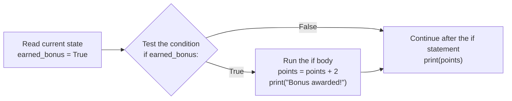
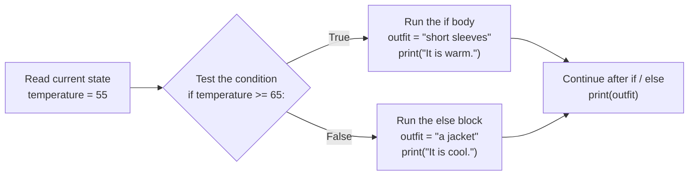
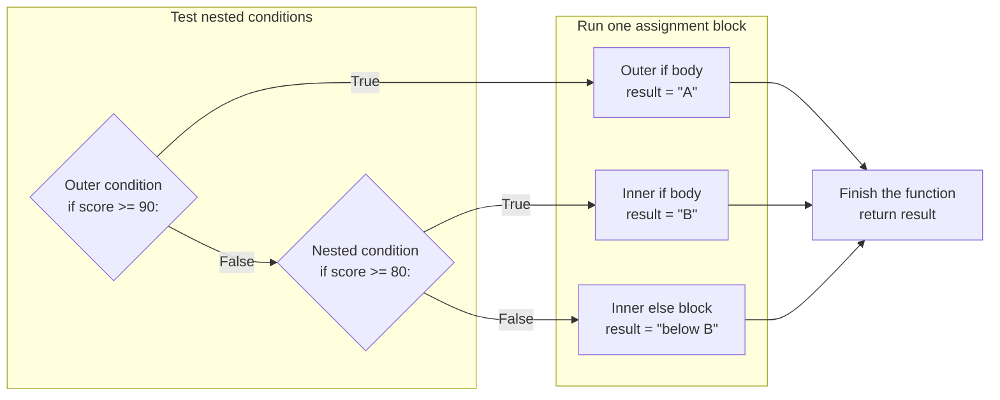
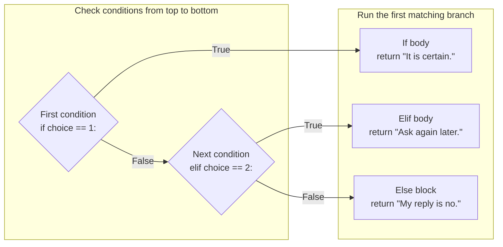

Variables let a program remember what is happening. **Conditional statements** let it respond. A game can unlock an achievement when a player reaches a target score, a streaming app can adjust video quality when a connection slows down, and a weather app can turn a precipitation percentage into a message such as “Rain is unlikely” or “Rain is likely.” Without conditional control flow, a program would take the same actions no matter what data it received.

Python normally executes statements in order from top to bottom. **Control flow** statements can change that path. Each condition becomes a decision point where the program can choose whether a **block** of code should run. We will begin with decisions in Globals, then use parameters and local variables to guide decisions inside functions.

## Conditional Control Flow

### Boolean Conditions Decide Whether a Block Runs

An `if` statement begins with the keyword `if`, followed by a **condition** and a colon. Conditions are Boolean expressions that evaluate to either `True` or `False`.[^truth-value-rules]

The indented statements below the header form the **if body**, also known as the **then block**.

- When the condition evaluates to `True`, Python enters the body and runs every statement in it from top to bottom.
- When the condition evaluates to `False`, Python skips the entire body.
- After either path, Python continues with the first statement following the body.

Step through this program twice. First observe how `points` changes when `earned_bonus` is `True`. Then change it to `False`, reset the diagram, and notice that Python skips both statements in the if body.

~~~python_diagram_runner { editable=true title="A One-Way Decision" }
points: int = 8
earned_bonus: bool = True

if earned_bonus:
    points = points + 2
    print("Bonus awarded!")

print(points)
~~~

The decision diamond represents `if earned_bonus:`. The `True` arrow enters the indented block containing both `points = points + 2` and `print("Bonus awarded!")`, while the `False` arrow bypasses both statements. The paths meet at `print(points)`, the first statement after the conditional.

The colon after `if earned_bonus` announces that an indented block follows. Both the assignment and the first `print` are part of that block because they have the same indentation. The final `print` is not indented, so it runs regardless of the condition.

A condition can be a Boolean variable such as `earned_bonus`, or an expression that produces a Boolean value. Comparisons such as `temperature >= 80`, `name == "Ada"`, and `attempts < 3` all evaluate to `True` or `False`.

### `else` Provides a Second Branch

Add an `else` **branch** when a program should choose exactly one of two blocks. The indented block after its header is the **else body**, also known as the **else block**. The `else` header has no condition: it runs precisely when the preceding `if` condition is false.

~~~python_diagram_runner { editable=true title="Choosing Between Two Branches" }
temperature: int = 55
outfit: str = ""

if temperature >= 65:
    outfit = "short sleeves"
    print("It is warm.")
else:
    outfit = "a jacket"
    print("It is cool.")

print(outfit)
~~~

The expression in `if temperature >= 65:` controls both branches. Each branch box includes both indented statements: it assigns an outfit and prints the matching description. Both paths meet at `print(outfit)`.

Python evaluates `temperature >= 65` only once during this encounter with the conditional statement. If the result is `True`, Python runs the if body and skips the else body. If it is `False`, Python skips the if body and runs the else body. It never runs both branches during the same encounter.

After the selected branch finishes, the two possible paths meet at `print(outfit)`. Try temperatures on both sides of the boundary, including exactly `65`.

### Conditional Statements Can Be Nested

A control flow statement can appear anywhere a regular statement can appear, including inside another block. This is **nested control flow**.

The outer condition in the following function separates A grades from all other grades. Python reaches the inner condition only when the outer condition is false and it enters the outer else body.

~~~python { runnable=true editable=true title="Nested Conditional Statements" }
def grade_label(score: int) -> str:
    """Return a label for one of three score ranges."""
    result: str = ""

    if score >= 90:
        result = "A"
    else:
        if score >= 80:
            result = "B"
        else:
            result = "below B"

    return result

print(grade_label(score=95))
print(grade_label(score=85))
print(grade_label(score=75))
~~~

The second diamond represents the `if score >= 80:` statement nested inside the outer `else:` block. Its position in the flow matches its additional level of indentation in the syntax. Each action box shows the `result` assignment made by that path before all three paths meet at `return result`.

For `95`, the first condition is true, so the entire outer else body, including its inner `if` statement, is skipped. For `85` and `75`, the outer condition is false, so Python enters the else body and evaluates the inner condition.

Indentation reveals the structure. The inner `if` is indented because it belongs to the outer else body. Its two assignment statements are indented again because they belong to its branches.

### `elif` Expresses a Multiway Choice More Clearly

A chain of nested else and if statements can become difficult to scan. Python's **`elif`** keyword is short for “else if” and expresses the same kind of multiway decision with less indentation. It does not add a new branching capability; it gives an equivalent decision chain a clearer shape.

Python checks an `if`/`elif` chain from top to bottom:

1. Evaluate the `if` condition.
2. If it is false, evaluate the first `elif` condition.
3. Continue until a condition is true.
4. Run that branch and skip every remaining branch.
5. Run the optional final `else` only if all preceding conditions are false.

This Magic 8 Ball defines the same three choices twice. The first function uses nested conditionals, while the second uses an `elif` chain. One random choice is stored and passed to both functions so you can verify that their results are equivalent.

~~~python { runnable=true editable=true title="Nested Conditions and an Equivalent elif Chain" }
from random import randint

def nested_reply(choice: int) -> str:
    """Choose a reply using nested conditional statements."""
    if choice == 1:
        return "It is certain."
    else:
        if choice == 2:
            return "Ask again later."
        else:
            return "My reply is no."

def elif_reply(choice: int) -> str:
    """Choose the same reply using an elif chain."""
    if choice == 1:
        return "It is certain."
    elif choice == 2:
        return "Ask again later."
    else:
        return "My reply is no."

answer_number: int = randint(1, 3)
print(answer_number)
print(nested_reply(choice=answer_number))
print(elif_reply(choice=answer_number))
~~~

Each diamond corresponds to a condition in the `elif_reply` function. Python follows the first `True` arrow it encounters and runs the return statement in that branch. The final `else:` supplies the return statement used when both conditions are `False`.

The `elif` version makes the single chain of choices visible. Because Python stops after the first true condition, order matters whenever conditions overlap.

For example, a test for `score >= 80` must come after a test for `score >= 90`. Reversing them would cause a score of `95` to take the `score >= 80` branch before Python ever reached the more specific condition.

## Common If Statement Errors

### Misreading Indentation

Indentation determines which block owns a statement. These two procedures differ only in the indentation of `print("Checked.")`.

~~~python { runnable=true editable=true title="Indentation Changes Control Flow" }
def report_only_positive(value: int) -> None:
    if value > 0:
        print("Positive.")
        print("Checked.")

def always_report_check(value: int) -> None:
    if value > 0:
        print("Positive.")
    print("Checked.")

report_only_positive(value=-1)
always_report_check(value=-1)
~~~

The first call prints nothing because both statements belong to its if body. The second call prints `Checked.` because that statement is outside the if body and runs after the conditional for either Boolean result.

[^truth-value-rules]: Python can also test non-Boolean values using truth-value testing, also known as truthiness. These rules are more complex: for example, zero and empty values are falsy, while many other values are truthy. Some truth-value tests are concise and idiomatic in Python, but using implicit truthiness in ways that hide a value's type or intent is poor practice. Prefer conditions designed to produce an actual `bool`; explicit Boolean expressions are easier to read, type-check, and reason about.
