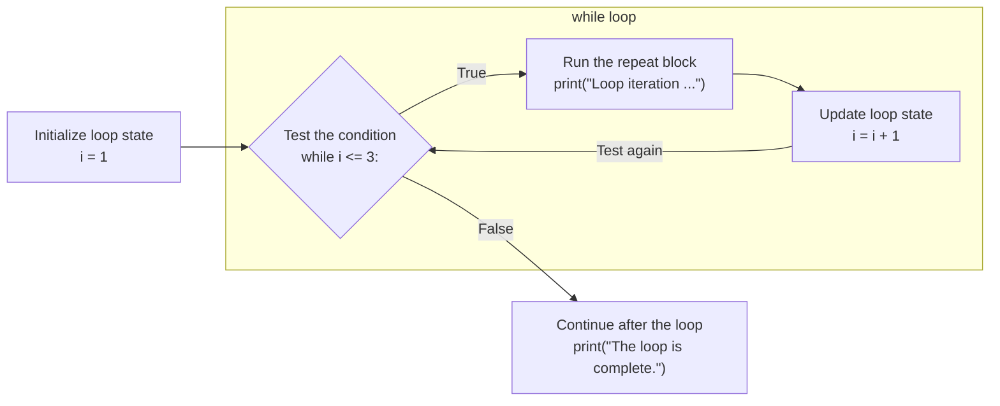
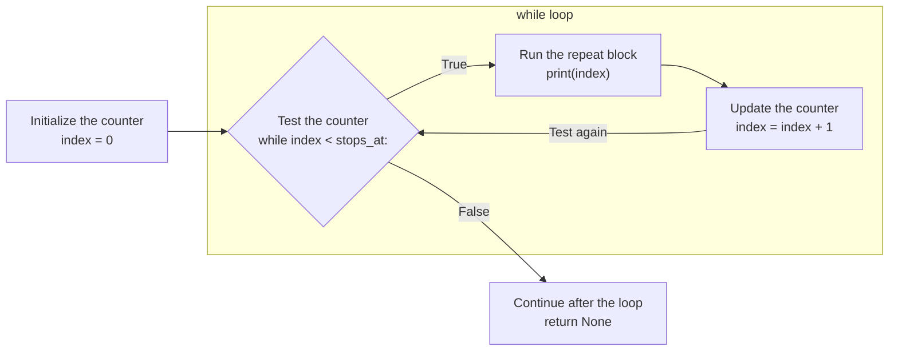
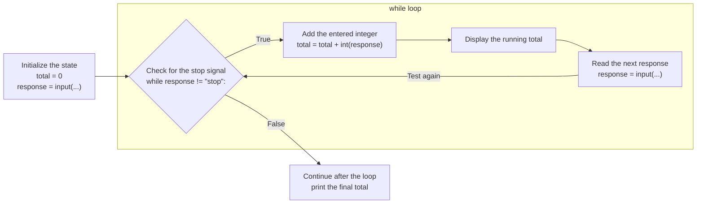

Many familiar digital tasks repeat for an amount of time that can change. A download receives pieces until the file is complete, a game updates while a round is active, and a messaging app works through queued messages until none remain. A **loop** lets a small block of code perform that repeated work, turning a few statements into a process that can handle changing amounts of data.

Python's `while` statement repeats as long as a Boolean condition remains `True`. This makes it useful whenever a program can recognize that more work remains, even when it cannot predict exactly how many iterations the work will require. We will use while loops to count, traverse strings, build results, and respond to input.

## Looping Control Flow

### A `while` Statement Repeats a Block

A `while` statement resembles an `if` statement: both have a Boolean condition, a colon, and an indented body. Their behavior differs at the end of the body.

- An `if` body runs at most once.
- A `while` **loop body**, also known as the **repeat block**, returns control to the loop's condition after every completed **iteration**.

Python tests a **while condition** before each potential iteration. If it is `True`, Python runs the body and tests again. If it is `False`, Python leaves the loop and continues below it. A while loop may therefore run zero times, once, or many times.

~~~python { runnable=true editable=true title="Repeating a Block with while" }
i: int = 1

while i <= 3:
    print("Loop iteration " + str(i))
    i = i + 1

print("The loop is complete.")
~~~

The `while loop` boundary contains the condition and every indented statement in the repeat block. The `True` path runs `print(...)` and `i = i + 1` before returning to `while i <= 3:`. The `False` path leaves the boundary and reaches the unindented final `print`.

When `i` becomes `4`, Python returns to the header and evaluates `4 <= 3` as `False`. It does not enter the body again, and execution continues with the final `print`.

Use the memory diagram below to follow the same program one statement at a time. Watch the value of `i` during each iteration and notice when control returns to the while condition.

~~~python_diagram_runner { editable=true title="Stepping Through while Iterations" }
i: int = 1

while i <= 3:
    print("Loop iteration " + str(i))
    i = i + 1

print("The loop is complete.")
~~~

After tracing all three iterations, change the initialization of `i` to `4` and reset the diagram. Because a while condition is tested before the repeat block, the loop will perform zero iterations.

### Counter-Controlled Loops Repeat a Known Number of Times

When a block should repeat a known number of times, a **counter-controlled loop** coordinates three pieces:

1. **Initialize** a **counter** before the loop.
2. **Test** the counter in the while condition.
3. **Update** the counter in the loop body.

The common pattern starts the counter at `0`, continues while it is less than the desired number of repetitions, and adds `1` after each iteration.

Step through this function call and watch the local variable `index` take the values `0`, `1`, `2`, and finally `3` in the call's frame.

~~~python_diagram_runner { editable=true title="A Counter in a Function Call's Frame" }
def count_up(stops_at: int) -> None:
    """Print each integer from zero up to, but not including, stops_at."""
    index: int = 0

    while index < stops_at:
        print(index)
        index = index + 1

    return None

count_up(stops_at=3)
~~~

The initialization `index = 0` appears before the `while` header. The test is written in `while index < stops_at:`, and the update `index = index + 1` is inside the repeat block. The loop boundary keeps the backward path separate from `return None`, which runs only after the condition becomes `False`.

The body runs for `index` values `0`, `1`, and `2`: exactly three iterations. The update makes progress toward termination by moving `index` toward a value that makes `index < stops_at` false.

Starting at zero and stopping before the upper bound is a useful convention because it agrees with the indices of sequences such as strings.

### Zero-Based Counters Match String Indices

A string is a sequence of characters. If a string has length `n`, its valid indices begin at `0` and end at `n - 1`. A counter that starts at `0` and continues while it is less than `len(text)` visits every valid index exactly once.

~~~python { runnable=true editable=true title="Visiting Every Character in a String" }
word: str = input("Enter text to visit one character at a time: ")
index: int = 0

while index < len(word):
    print(word[index])
    index = index + 1
~~~

If the user enters `"flow"`, `len(word)` is `4`, while the valid indices are `0`, `1`, `2`, and `3`. Try inputs of different lengths and notice that the same loop visits every character exactly once. The condition becomes false as soon as `index` reaches the length of the entered string, before Python attempts to read an invalid position.

A loop can also build a result a little at a time. To reverse a string, begin at its last valid index and move backward. The local variable `result` is an **accumulator**: it holds the partial answer built by the iterations completed so far.

~~~python { runnable=true editable=true title="Building a Reversed String" }
def reverse(text: str) -> str:
    """Return text with its characters in reverse order."""
    result: str = ""
    index: int = len(text) - 1

    while index >= 0:
        result = result + text[index]
        index = index - 1

    return result

text_to_reverse: str = input("Enter text to reverse: ")
print(reverse(text=text_to_reverse))
~~~

Use the memory diagram below to trace a shorter call one statement at a time. Watch `index` move backward from `3` to `-1` while `result` grows from `""` to `"wolf"` in the function call's frame.

~~~python_diagram_runner { editable=true title="Tracing a Reversed String" }
def reverse(text: str) -> str:
    """Return text with its characters in reverse order."""
    result: str = ""
    index: int = len(text) - 1

    while index >= 0:
        result = result + text[index]
        index = index - 1

    return result

print(reverse(text="flow"))
~~~

For any entered string, the first iteration appends its last character, the second appends its next-to-last character, and so on. In the memory diagram, `"flow"` begins at index `3`. Once `index` becomes `-1`, the condition is false and the completed accumulator is returned to the caller.

### Condition-Controlled Loops Can Wait for a Signal to Stop

Sometimes a program does not know the number of iterations in advance. Instead, the loop continues until program state or an external source provides a stopping signal. This is a **condition-controlled loop**.

The following program keeps a running total of the integers a user enters. It reads the first response before the loop, then continues adding values until the user enters `stop`.

~~~python { runnable=true editable=true title="Adding Numbers Until the User Stops" }
total: int = 0
response: str = input("Enter an integer, or enter stop to finish: ")

while response != "stop":
    total = total + int(response)
    print("Running total: " + str(total))
    response = input("Enter an integer, or enter stop to finish: ")

print("Final total: " + str(total))
~~~

The condition checks the string response before the loop converts it to an integer. When the response is `"stop"`, Python skips the loop body, so `int(response)` is never asked to convert the stopping word. Every integer response is added to `total`, which is an accumulator that preserves the sum across iterations.

When execution reaches `input`, the program pauses and an input field appears beside the prompt in the output area. Enter an integer and press Enter to add it, or enter `stop` to leave the loop. For example, entering `7`, `-2`, and `stop` produces a final total of `5`. Unlike a counter-controlled loop, the program cannot predict in advance how many numbers the user will enter.

This pattern is a small model of an **event loop**. Interactive programs often repeat three broad actions: wait for input, handle that input, and wait again. Real user-interface event loops involve more machinery, but their repetition is still grounded in the same control-flow idea.

### Loops Can Perform Large Computations Quickly

A computer can complete far more iterations than would be practical to trace by hand. The following program uses 100,000 iterations of a mathematical series to approximate pi. Each iteration adds or subtracts the reciprocal of the next odd number. Multiplying the accumulated result by `4` produces the approximation.

~~~python { runnable=true editable=true title="Approximating Pi with 100,000 Iterations" }
terms: int = 100_000
index: int = 0
quarter_pi: float = 0.0
sign: float = 1.0

while index < terms:
    quarter_pi = quarter_pi + sign / (2 * index + 1)
    sign = -sign
    index = index + 1

pi_approximation: float = quarter_pi * 4
print("After " + str(terms) + " iterations:")
print(round(pi_approximation, 10))
~~~

The loop performs all 100,000 iterations but prints only the completed result. This separation is useful because the computation is fast, while producing and displaying 100,000 lines of output would add substantial unnecessary work.

## Common While Loop Errors

### Writing a Loop that Cannot Make Progress

A loop must have a believable path toward making its condition false. The following loop never changes `counter`, so `counter < 3` remains true forever.

~~~python
counter: int = 0

while counter < 3:
    print(counter)
~~~

This is an **infinite loop**. Do not run it. Before running any while loop, identify which statement changes the values used by its condition and check that the change moves toward termination.

### Off-by-One Bounds

An **off-by-one error** uses a boundary that is one step too early or too late. This loop uses `<=` where string indexing requires `<`. It successfully prints four characters, then attempts to read `word[4]` and reports an `IndexError`.

~~~python { runnable=true editable=true title="An Off-by-One Error" }
word: str = input("Enter text to test the loop boundary: ")
index: int = 0

while index <= len(word):
    print(word[index])
    index = index + 1
~~~

For any entered string of length `n`, the last valid index is `n - 1`. The `<=` condition incorrectly allows an attempt to read `word[n]`. The correct continuation condition is `index < len(word)`.
