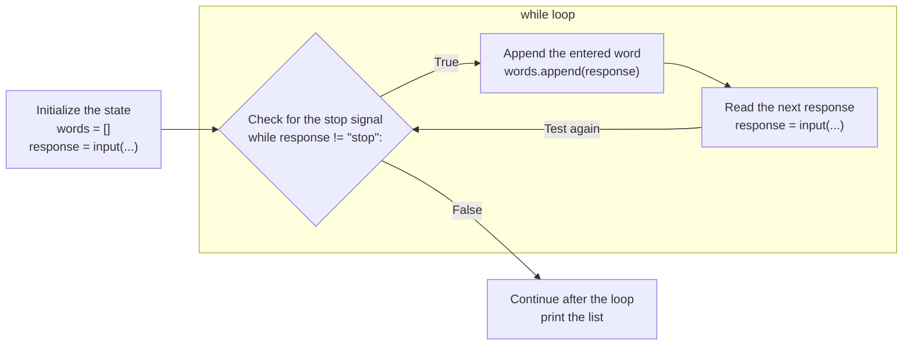
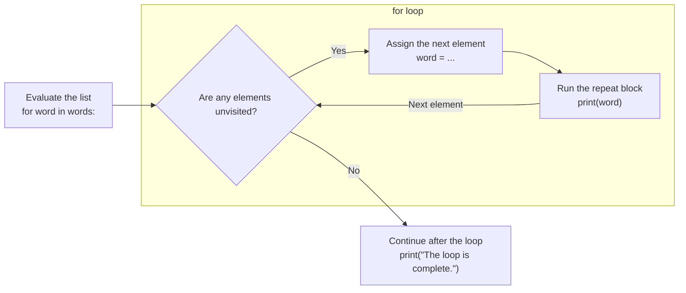

A game keeps track of every roll a player has made. A gradebook holds every score submitted in a course. A messaging app maintains the queue of messages waiting to be sent. In each case, the number of values is not known ahead of time and can grow as the program runs. A **list** holds an ordered sequence of values under a single name, so one variable can refer to zero values, one value, or thousands.

Lists are also the first **reference type** we will use. Their values live in a different part of memory than the `int`, `float`, `str`, and `bool` values you have worked with so far, and that difference explains some behavior that surprises many new programmers. This page introduces list syntax, shows how lists behave in memory diagrams, and uses `while` and `for` loops to work with every element of a list.

## Lists and Primitive Types

### Primitive Types Hold One Value

Each of the types you have used so far holds exactly one value. An `int` variable refers to one integer, a `str` variable refers to one string, and so on. We call these **primitive types**. When one of these values is stored in a variable, the value itself is written into the variable's box in the memory diagram.

Primitive values are also **immutable**: they cannot be changed after they are created. The expression `i + 1` does not change the integer `i` refers to; it evaluates to a new integer. Reassignment then stores that new value in the variable.

~~~python_diagram_runner { editable=true title="Primitive Values are Copied" }
a: int = 5
b: int = a

b = b + 1

print(a)
print(b)
~~~

Step through this diagram. After `b: int = a`, the variable `b` holds its own copy of `5`. Reassigning `b` has no effect on `a`.

### Lists Can Hold Many Values, and They Live on the Heap

A list holds zero or more **elements** in order. The type annotation for a list names the element type inside square brackets: a `list[int]` holds integers, and a `list[str]` holds strings.

A list is not written into a variable's box. Instead, the list itself is stored in a separate region of memory called the **heap**, and the variable holds a **reference** to it. In a memory diagram, a reference is drawn as an arrow from the variable to the list on the heap. Types whose values are stored this way are called **reference types**.

Lists are also **mutable**: a list can be changed after it is created. Elements can be replaced, added, or removed, all without creating a new list. We will see why this matters once two variables refer to the same list.

## List Syntax

### Initializing a List

A **list literal** is written with square brackets. An empty pair of brackets, `[]`, is an empty list. The call `list()` also produces an empty list. Elements can be written between the brackets, separated by commas.

~~~python_diagram_runner { editable=true title="Initializing Lists" }
guesses: list[str] = []
scores: list[int] = list()
rolls: list[int] = [4, 6, 1, 6]

print(guesses)
print(scores)
print(rolls)
~~~

Step through the diagram and notice that each variable's arrow points to a list on the heap, even when the list is empty.

The `len` function returns the number of elements in a list. For `rolls` above, `len(rolls)` evaluates to `4`; for either empty list, it evaluates to `0`.

### Accessing an Element with Subscription Notation

Every element has an **index**, its position in the list counting up from `0`. Just as with strings, the first element is at index `0` and the last is at index `len(items) - 1`.

**Subscription notation** reads one element: the list's name followed by an index in square brackets. The expression `rolls[0]` evaluates to the first element of `rolls`.

~~~python { runnable=true editable=true title="Reading Elements" }
rolls: list[int] = [4, 6, 1, 6]

print(rolls[0])
print(rolls[3])
print(rolls[0] + rolls[1])
print(len(rolls))
~~~

A subscription expression produces a value of the element type, so `rolls[0] + rolls[1]` adds two integers and evaluates to `10`. Reading an index that does not exist, such as `rolls[4]`, produces an **`IndexError`**.

### Changing an Element at a Particular Index

Subscription notation can also appear on the left-hand side of an assignment. This replaces the element at that index. The list is mutated; no new list is created.

~~~python_diagram_runner { editable=true title="Changing an Element" }
rolls: list[int] = [4, 6, 1, 6]
print(rolls)

rolls[2] = 5
print(rolls)
~~~

### Appending an Element with `append`

The **`append`** method adds a new element to the end of a list. It is written with a period after the list's name, then the method name, then the value to add in parentheses. Because `append` mutates the list, the variable does not need to be reassigned; the list it refers to simply grows.

~~~python_diagram_runner { editable=true title="Appending Elements" }
guesses: list[str] = []

guesses.append("e")
guesses.append("t")

print(guesses)
print(len(guesses))
~~~

### Removing an Element with `pop`

The **`pop`** method removes an element and returns it. With no argument, `pop()` removes the last element. With an index, `pop(0)` removes the element at that index, and the elements after it shift down to fill the gap. Since `pop` returns the removed element, its result can be stored or used in an expression. Calling `pop` on an empty list produces an `IndexError`.

~~~python_diagram_runner { editable=true title="Popping Elements" }
rolls: list[int] = [4, 6, 1, 6]

last: int = rolls.pop()
print(last)
print(rolls)

first: int = rolls.pop(0)
print(first)
print(rolls)
~~~

### You Try: A Stack of Plates

In a cafeteria, the last plate placed on the stack is the first one taken. Complete the program so that it appends `"plate 3"` to `stack`, then pops the top plate into `taken`. The program should print `plate 3` and then `['plate 1', 'plate 2']`.

~~~python { runnable=true editable=true title="You Try: Plate Stack" }
stack: list[str] = ["plate 1", "plate 2"]

# TODO: Append "plate 3".

# TODO: Pop the last element and store it in taken.
taken: str = ""

print(taken)
print(stack)
~~~

## Two Variables Can Refer to the Same List

When a list is assigned from one variable to another, only the reference is copied. Both variables now point to the same list on the heap. Mutating the list through either variable changes the one list that both refer to. This is the most important difference between reference types and primitive types.

~~~python_diagram_runner { editable=true title="Two Variables, One List" }
original: list[int] = [1, 2, 3]
alias: list[int] = original

alias.append(4)
alias[0] = 100

print(original)
print(alias)
~~~

Step through the diagram. After `alias: list[int] = original`, there are two variables and two arrows, but still only one list. Both mutations change that list, so `original` prints `[100, 2, 3, 4]` even though the variable `original` was never used to make a change. Compare this with the `int` example at the top of the page, where reassigning `b` left `a` untouched.

### Reassignment is Not Mutation

Reassigning a variable from one list to another will cause it to refer to a different list (at a different ID on the heap!). It does not mutate the list the variable used to refer to.

~~~python_diagram_runner { editable=true title="Reassigning a List Variable" }
original: list[int] = [1, 2, 3]
alias: list[int] = original

alias = [1, 2, 3, 4]

print(original)
print(alias)
~~~

Here `alias = [1, 2, 3, 4]` evaluates a new list literal on the heap and stores a reference to it in `alias`. Two lists now exist, and `original` still refers to the first, so it prints `[1, 2, 3]`.

To decide what a statement does to a list, ask whether it mutates the list (`append`, `pop`, or assignment through subscription notation) or reassigns a variable (assignment to a bare variable name). Only the first kind of statement affects every variable that shares the list.

## Lists and Functions

### A List Argument is a Reference

When a list is passed as an argument, the parameter receives a reference to the caller's list, not a copy. The parameter and the caller's variable are two names for one list, just like `original` and `alias` above. Mutating the list inside the function therefore changes the caller's list.

~~~python_diagram_runner { editable=true title="Mutating a List Parameter" }
def add_bonus(scores: list[int]) -> None:
    """Append a bonus of 10 to scores. Mutates scores."""
    scores.append(10)

game_scores: list[int] = [7, 3]
add_bonus(scores=game_scores)
print(game_scores)
~~~

Notice that `add_bonus` returns `None`, yet `game_scores` has three elements after the call. The function did not return a new list; it changed the list that `game_scores` refers to. Its docstring says so, which lets a caller know to expect the change without reading the function's local steps.

### Global Lists Can Be Read Inside a Function

Name resolution for lists works the same way as for any other variable. When a function reads a name that is not local, Python looks in Globals. A function can therefore read a global list without a parameter.

~~~python_diagram_runner { editable=true title="Reading a Global List" }
high_scores: list[int] = [88, 92, 75]

def show_first() -> None:
    """Print the first high score."""
    print(high_scores[0])

show_first()
~~~

### Global Lists Can Be Mutated Inside a Function

Because `append`, `pop`, and subscription assignment mutate a list rather than reassign a variable, a function can mutate a global list without the `global` statement. The name `high_scores` resolves to the global variable, and the mutation changes the list it refers to.

~~~python_diagram_runner { editable=true title="Mutating a Global List" }
high_scores: list[int] = [88, 92]

def record_score(score: int) -> None:
    """Append score to the global list high_scores. Mutates high_scores."""
    high_scores.append(score)

record_score(score=95)
record_score(score=70)
print(high_scores)
~~~

Only reassignment of a global name requires the `global` statement. If `record_score` tried to write `high_scores = [score]`, that assignment would create a local variable instead. The difference is worth remembering: mutation reaches through the reference to the shared list, while reassignment only changes which list the local name refers to.

!!! warning "Mutating Global Lists"

    A function that mutates a global list is no longer a black box. Its behavior depends on, and changes, state that lives outside its parameters and return value. As a program grows, every function that appends to, pops from, or assigns into the same global list can affect every other function that reads it. To understand the list's contents at one line, we may need to trace every place in the program that could have changed it.

    Most functions should receive lists through parameters and communicate results through return values. When a function must mutate a list, whether a global list or a parameter, state that clearly in its docstring, as `add_bonus` and `record_score` do. A reader of the docstring should never be surprised by a list changing.

### You Try: Document the Mutation

The function below mutates the global list `queue` but its docstring does not say so. Rewrite the docstring to describe what the function does and to state that it mutates `queue`. Then add a second function, `next_message`, which pops and returns the first element of `queue`, with a docstring that also notes the mutation.

~~~python { runnable=true editable=true title="You Try: Document a Mutating Function" }
queue: list[str] = []

def send(message: str) -> None:
    """Send a message."""
    queue.append(message)

# TODO: Define next_message() -> str here.

send(message="hello")
send(message="how are you?")
print(queue)
~~~

## Iterating Through a List with a `while` Loop

The counter-controlled loop you learned for strings works for lists without change. A counter starts at `0`, continues while it is less than `len(items)`, and increases by `1` at the end of the repeat block. Each iteration reads one element with subscription notation.

Step through this diagram and watch `i` change while the list on the heap stays the same.

~~~python_diagram_runner { editable=true title="Visiting Each Element" }
words: list[str] = ["apple", "banana", "cherry"]

i: int = 0
while i < len(words):
    print(words[i])
    i = i + 1
~~~

The last valid index is `2` even though the list has `3` elements. A condition of `i <= len(words)` would be an off-by-one error: the repeat block would be executed once more with `i` equal to `3`, and reading `words[3]` would produce an `IndexError`.

### Accumulating with a `while` Loop

An accumulator combines every element into one result. Here, each iteration adds one turn's points to a running total.

~~~python { runnable=true editable=true title="Total Points Across Turns" }
def total_points(turns: list[int]) -> int:
    """Add up the points earned across every turn."""
    total: int = 0
    i: int = 0
    while i < len(turns):
        total = total + turns[i]
        i = i + 1
    return total

print(total_points(turns=[8, 0, 15, 6]))
~~~

Notice that `total_points` reads from `turns` but never mutates it, so its docstring needs no note about mutation.

### Populating a List with a `while` Loop

A condition-controlled loop can populate a list from input. This program appends every entered word until the user enters `stop`. The list grows by one element per iteration, and the program cannot predict its final length in advance.

~~~python { runnable=true editable=true title="Collecting Words Until the User Stops" }
words: list[str] = []
response: str = input("Enter a word, or enter stop to finish: ")

while response != "stop":
    words.append(response)
    response = input("Enter a word, or enter stop to finish: ")

print(words)
print(len(words))
~~~

The stopping word is never appended, because the condition evaluates to `False` before the repeat block is reached for that response.

## Iterating Through a List with a `for` Loop

Visiting every element of a list, in order, is so common that Python provides a second kind of loop for exactly that job. Where a `while` loop repeats as long as a condition evaluates to `True`, a **`for` loop** repeats once for each element of a list.

### The `for` Statement

A `for` statement has four parts, followed by a colon and an indented repeat block:

1. The keyword `for`.
2. A **loop variable**, a new variable name that will refer to one element at a time.
3. The keyword `in`.
4. A list expression, most often the name of a list.

~~~python { runnable=true editable=true title="A for Statement" }
words: list[str] = ["apple", "banana", "cherry"]

for word in words:
    print(word)

print("The loop is complete.")
~~~

Python evaluates a `for` loop as follows:

1. Evaluate the list expression after `in` to find the list to visit.
2. If any elements remain unvisited, assign the next element to the loop variable and execute the repeat block. Otherwise, leave the loop.
3. After the repeat block completes, return to step 2.

There is no counter to initialize, no condition to write, and no update statement at the end of the repeat block. Python performs all three of those steps for us. The loop variable takes the values `"apple"`, then `"banana"`, then `"cherry"`, and the loop ends after the repeat block has been executed for the last element. If the list is empty, the repeat block is never executed, just as a `while` loop performs zero iterations when its condition is `False` from the start.

The loop variable is a variable like any other. It is added to the current frame when it is first assigned, before the first iteration, and its type is the element type of the list: a `list[str]` gives the loop variable type `str`. Any name can be used, but choosing the singular form of the list's name, such as `word` for `words` or `score` for `scores`, communicates that each iteration works with one element.

### Comparing `for` and `while`

These two programs print the same output. Step through each and compare what appears in the frame.

~~~python_diagram_runner { editable=true title="Printing Elements with while" }
words: list[str] = ["apple", "banana", "cherry"]

i: int = 0
while i < len(words):
    print(words[i])
    i = i + 1
~~~

~~~python_diagram_runner { editable=true title="Printing Elements with for" }
words: list[str] = ["apple", "banana", "cherry"]

for word in words:
    print(word)
~~~

The `while` version keeps a counter `i` in the frame and reads each element with `words[i]`. The `for` version keeps the element itself in `word` and never needs an index.

A `for` loop removes three common opportunities for mistakes: forgetting to initialize the counter, writing `<=` instead of `<`, and forgetting to update the counter. Prefer a `for` loop whenever a task visits every element of a list once, in order. Use a `while` loop when the number of iterations depends on a condition, such as waiting for the user to enter `stop`, or when the counter should move by a step other than `1`.

### You Try: Rewrite with `for`

Rewrite this `while` loop as a `for` loop that prints the same output. Name the loop variable `score`.

~~~python { runnable=true editable=true title="You Try: Rewrite with for" }
scores: list[int] = [88, 92, 75]

# TODO: Replace the while loop with a for loop.
i: int = 0
while i < len(scores):
    print(scores[i])
    i = i + 1
~~~

### Accumulating with a `for` Loop

The accumulator pattern reads the element from the loop variable instead of through subscription notation.

~~~python { runnable=true editable=true title="Total Points with for" }
def total_points(turns: list[int]) -> int:
    """Add up the points earned across every turn."""
    total: int = 0
    for points in turns:
        total = total + points
    return total

print(total_points(turns=[8, 0, 15, 6]))
~~~

### Populating a New List with a `for` Loop

A `for` loop can build a new list from an existing one. The result is initialized as an empty list before the loop, and `append` adds to it during the iterations where a condition evaluates to `True`. The original list is not mutated.

~~~python { runnable=true editable=true title="Keeping Scoring Rolls" }
def scoring_rolls(rolls: list[int]) -> list[int]:
    """Build a new list of the rolls that are not ones."""
    result: list[int] = []
    for roll in rolls:
        if roll != 1:
            result.append(roll)
    return result

print(scoring_rolls(rolls=[5, 1, 3, 6, 1, 2]))
~~~

### Changing Elements Requires an Index

Assigning to the loop variable of a `for` loop does not change the list. The loop variable refers to a copy of each element's value, and reassigning it only points the variable somewhere else.

~~~python_diagram_runner { editable=true title="Reassigning the Loop Variable" }
prices: list[float] = [2.0, 4.0]

for price in prices:
    price = price * 2.0

print(prices)
~~~

The list still prints `[2.0, 4.0]`. To mutate the elements themselves, a loop needs each index so that it can assign through subscription notation. A `while` loop with a counter works, and so does a `for` loop over `range(len(prices))`, where the **`range`** function produces the integers from `0` up to, but not including, its argument.

~~~python_diagram_runner { editable=true title="Changing Elements with an Index" }
prices: list[float] = [2.0, 4.0]

for i in range(len(prices)):
    prices[i] = prices[i] * 2.0

print(prices)
~~~

### You Try: Count Passing Scores

Write `count_passing`, which returns how many elements of `scores` are greater than or equal to `threshold`. Use a `for` loop and a counter that increases only when the condition evaluates to `True`.

~~~python { runnable=true editable=true title="You Try: Count Passing Scores" }
def count_passing(scores: list[float], threshold: float) -> int:
    """Count the scores that are at or above the threshold."""
    # TODO: Count the elements greater than or equal to threshold.
    return 0

print(count_passing(scores=[72.0, 88.5, 64.0, 95.0], threshold=70.0))
~~~

The call above should print `3`.

### You Try: Predict the Output

Before running this program, write down what each `print` will display. Then run it to check your prediction.

~~~python { runnable=true editable=true title="You Try: Predict the Output" }
def append_all(target: list[str], items: list[str]) -> None:
    """Append every element of items to target. Mutates target."""
    for item in items:
        target.append(item)

first: list[str] = ["a", "b"]
second: list[str] = first
third: list[str] = ["a", "b"]

append_all(target=second, items=["c"])
third.append("z")

print(first)
print(second)
print(third)
~~~

## Common List Errors

### Reading Past the End of a List

The last valid index of a list is `len(items) - 1`. A loop condition of `i <= len(items)` is an off-by-one error that attempts to read one element past the end and produces an `IndexError`. The correct continuation condition is `i < len(items)`.

### Expecting `append` to Return the List

`append` mutates the list and returns `None`. Writing `rolls = rolls.append(6)` replaces the list reference in `rolls` with `None`, and the next subscription or `append` on `rolls` fails. Call `append` as a statement on its own line and do not assign its result.

### Assuming Assignment Copies a List

`alias = original` does not create a second list. If a program needs an independent copy so that one can be changed without affecting the other, it must build a new list, for example by appending each element of the original to an empty list in a loop.

## Key Terminology Review

- **List**: A mutable, ordered sequence of elements stored on the heap.
- **Element**: One of the values held in a list.
- **Primitive type**: A type such as `int`, `float`, `str`, or `bool` whose single, immutable value is stored directly in a variable.
- **Reference type**: A type whose values are stored on the heap and referred to by variables through references. Lists are reference types.
- **Reference**: The location of a value on the heap, stored in a variable and drawn as an arrow in a memory diagram.
- **Heap**: The region of memory where lists and other reference-type values live.
- **Mutable**: Able to be changed after creation. Lists are mutable.
- **Immutable**: Not able to be changed after creation. Primitive values are immutable.
- **Mutation**: A change to an existing list, such as `append`, `pop`, or assignment through subscription notation.
- **List literal**: Square brackets containing zero or more comma-separated elements, such as `[]` or `[1, 2, 3]`.
- **Index**: The position of an element, counting up from `0`.
- **Subscription notation**: Square brackets after a list's name, such as `rolls[2]`, used to read or assign the element at an index.
- **`len`**: The function that returns the number of elements in a list.
- **`append`**: The method that adds an element to the end of a list and returns `None`.
- **`pop`**: The method that removes and returns an element; the last element by default, or the element at a given index.
- **`for` loop**: A loop written `for <variable> in <list>:` whose repeat block is executed once for each element of the list, assigning each element to the loop variable in turn.
- **Loop variable**: The variable a `for` loop assigns before each iteration.
- **`range`**: A function that produces the integers from `0` up to, but not including, its argument; `range(len(items))` produces every valid index of `items`.
- **`IndexError`**: The error Python reports when a subscription or `pop` uses an index that does not exist.